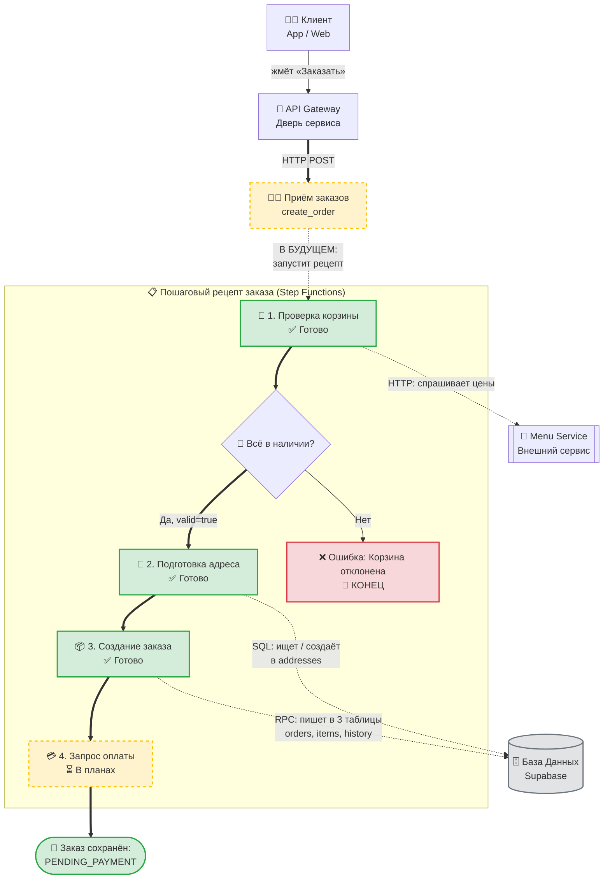

# 🍕 Order Service — что это и как работает

> Документ для людей, которые НЕ программируют, но хотят понять, что происходит внутри.
> Никакого кода. Только аналогии из жизни и простые слова.

---

## 📊 Визуальная схема полного флоу (одним взглядом)

> 🧭 **Как читать эту схему:**
> 1. Пробегитесь глазами **сверху вниз** по **жирным стрелкам `==>`** — это счастливый путь заказа.
> 2. 🟡 **Жёлтые блоки с пунктиром** — это то, что **в планах** (заглушки, будущее).
> 3. Пунктирные стрелки по бокам (`.->`) показывают, в какие моменты рецепт обращается во внешние системы: за ценами — в Menu Service, за данными — в Базу Данных Supabase.
> 4. **Большая центральная рамка** — это сам **«рецепт» (Step Functions)**, который прогоняет заказ по шагам в строгом порядке.
> 5. 🔴 **Красный блок** — остановка с ошибкой.
> 🟢 **Зелёный блок** — всё прошло успешно.



> 💡 Эта диаграмма **автоматически рендерится в GitHub** (и в любом Mermaid-просмотрщике). Если открываете документ в Markdown-редакторе без поддержки Mermaid — вы увидите просто блок кода, и это нормально.

---

## 0. Что это вообще такое?

**Order Service** — это «мозг» доставки еды. Тут живёт каждый заказ клиента от момента
«хочу пиццу» до «курьер доставил, спасибо».

Представь обычный ресторан с доставкой. Там есть:

- 📞 **менеджер** — отвечает на звонки и принимает заказ;
- 👨‍🍳 **повар** — готовит;
- 💰 **кассир** — считает деньги;
- 🛵 **курьер** — везёт;
- 🗄️ **картотека** — куда записывают все заказы и адреса.

В нашем случае вместо людей работают маленькие программки-«работники», а вместо
картотеки — база данных в облаке. Order Service — это и есть такая «виртуальная
кухня».

---

## 1. 🗣️ Главные персонажи — словарь терминов

Чтобы дальше не спотыкаться — вот таблица: технарь говорит «Lambda», мы говорим
«работник».

| Технический термин | Простое объяснение | Аналогия из жизни |
|---|---|---|
| **AWS Lambda** | Маленькая программа-работник. Пришла команда — Lambda сделала своё дело и ушла. Спит, пока не позовут. | Официант: стоит в углу, пока не придёт новый клиент. |
| **Step Functions** | Инструкция/рецепт, по которому несколько Lambda работают по очереди. Один шаг провалился — рецепт тормозит. | Рецепт блюда на кухне: «шаг 1 — нарезать, шаг 2 — жарить, шаг 3 — подать». |
| **API Gateway** | Дверь, через которую клиенты (сайт, приложение) стучатся к нам. | Входная дверь ресторана. |
| **Lambda handler** | Конкретный код, который запускается, когда Lambda «просыпается». Это то, что делает работник за время своей смены. | Что именно делает официант, когда его позвали. |
| **SNS (Simple Notification Service)** | Громкоговоритель на кухне. Кричит новости всем, кто подписан. | Рация диспетчера: всем станциям — «заказ готов!». |
| **SQS (Simple Queue Service)** | Почтовый ящик, куда складывают письма, чтобы прочитать позже. Гарантирует, что письмо не пропадёт. | Ящик «Входящие» на почте. |
| **AWS Secrets Manager** | Сейф, где хранятся пароли и ключи. Достаём, когда нужно подключиться к базе или чужому сервису. | Сейф с ключами в подсобке. |
| **SERVICE_SECRET_ARN** | Номер сейфа в облаке. Сам ключ внутри сейфа, никто его не видит. | Адрес сейфа, но не код от него. |
| **Supabase / Postgres** | База данных — наш «холодильник» с бумажными карточками. | Картотека в подвале ресторана. |
| **БД (база данных)** | Большая электронная таблица, где хранятся все заказы. | Те же карточки, только в компьютере. |
| **Таблица** | Один тип карточек. Например, «карточка заказа» или «карточка адреса». | Карточки одного цвета для одного типа записей. |
| **PostgREST / Resource embedding** | Хитрый способ забрать из БД сразу заказ + его позиции + историю в один заход. | Попросить «Дай мне заказ №5 вместе со всеми блюдами и заметками официанта». |
| **dataclass / DTO** | Шаблон карточки. Что обязательно должно быть: «заказ», «имя клиента», «адрес»… | Бланк анкеты: имя, адрес, телефон. |
| **Pydantic** | Охранник на входе. Проверяет, что в форме всё заполнено правильно, и не пропускает ерунду. | Контролёр на рамке — без билета не войдёшь. |
| **idempotent** | Свойство: можно запустить действие много раз — результат будет тот же. | Идемпотентный рецепт: испёк пиццу → достал → снова испёк → всё ещё одна пицца. |
| **RPC (Remote Procedure Call)** | Способ сходить в БД и попросить её выполнить кусок кода на её стороне. | Передать записку через окошко: «возьми все карточки из ящика X и сделай так». |
| **ON CONFLICT** | «Если такая запись уже есть — обнови, не ругайся». | Проштамповать документ второй раз — печать просто обновится. |
| **JSONB** | JSON-данные внутри БД. Удобно хранить списки и вложенные штуки. | Коробка, в которой лежат другие коробочки. |
| **Snapshot** | «Фотография» данных на момент покупки. Цена и название зафиксированы — даже если в меню их поменяют. | Записать «пицца 45 шекелей» в чек. Если завтра пицца будет 50, чек не изменится. |
| **Stub (заглушка)** | Код, который ещё не написан. Сейчас отвечает «не готово». | Табличка «Закрыто» в витрине — внутри ещё идут работы. |
| **cart / корзина** | Список блюд, которые клиент хочет заказать. | Корзина в супермаркете. |
| **subtotal** | Сумма стоимости всех блюд без доставки. | Цена продуктов в чеке, без стоимости доставки. |
| **line_total** | Цена одной позиции: цена × количество. | «2 пиццы по 45 = 90 шекелей». |
| **status (статус заказа)** | На каком этапе сейчас заказ. | Этап готовности: «ждёт оплаты», «оплачен», «готовится», «доставлен». |
| **delivery_address** | Куда везти заказ. | Адрес на коробке с пиццей. |
| **JWT / authorizer** | Электронный пропуск клиента, по которому сервис понимает, кто стучится. | Бейдж сотрудника. |
| **HTTP POST / GET** | Способ «толкнуть данные» или «спросить данные» через дверь API. | «Кинь письмо» (POST) и «прочитай объявление» (GET). |
| **ResultPath** | Путь/адрес в «рецепте», **куда** положить результат шага, чтобы следующий шаг его увидел. | Надпись на стене «овощи сюда» — кладёшь нарезанное в нужное место, следующий повар знает, где взять. |

---

## 2. 🍕 Полный флоу создания заказа (главная история)

Это сценарий «от нажатия кнопки до записанного заказа».

### Шаг 0. Клиент нажал «Заказать»

В мобильном приложении или на сайте клиент нажал «Заказать доставку». Приложение
собрало данные (что заказал, адрес) и шлёт запрос к нам.

### Шаг 1. 🚪 Дверь (API Gateway) принимает запрос

Запрос приходит на нашу «дверь» — **API Gateway**. Сейчас за дверью стоит
**Lambda `create_order`**, но она пока **заглушка**: говорит
*«Создание заказа — в разработке, приходи позже»* (HTTP-код 501).

> 🛠️ В **будущем** эта Lambda должна будет **запустить Step Functions** —
> то есть стартануть рецепт. Сам рецепт (`order-creation-state-machine.asl.json`)
> сейчас лежит в репозитории как **плейсхолдер** (чертёж), а настоящая
> state machine живёт в AWS (создаётся через деплой). Когда рецепт стартует,
> первым делом выполняется шаг `ValidateCart` (а не сама `create_order`).
> То есть цепочка такая: **API Gateway → `create_order` (запускает) →
> Step Functions → `ValidateCart` → и дальше по рецепту**.

### Шаг 2. 📋 Рецепт (Step Functions) запускается

Когда `create_order` допилят, рецепт будет прогонять каждый новый заказ через
несколько работников по очереди. Вот что внутри рецепта
(`orchestration/order-creation-state-machine.asl.json`):

```
ValidateCart → CartValidChoice → ResolveAddress → CreateOrderStep → ProcessPayment
```

#### 2.1 🥬 ValidateCart (проверка корзины) — `validate_order`

- Берёт из запроса **id ресторана** и **корзину** (список блюд с количеством).
- Звонит по HTTP в **Menu Service** (другая программа, которая знает все меню):
  *«Слушай, у вас пицца `item-001` есть? Сколько стоит?»*.
- Menu Service присылает ответ со **свежими ценами и доступностью**.
- Возвращает результат: `valid: true` со списком блюд и ценами, или
  `valid: false` с текстом, что не так.

> 🍳 Аналогия: официант, прежде чем принять заказ, сбегал на кухню и
> проверил, что всё есть в наличии. И заодно переписал цены из актуального меню.

#### 2.2 🚦 CartValidChoice (можно ли принять?)

Это автоматическая развилка внутри рецепта:

- Если `valid: true` — идём дальше.
- Если `valid: false` — рецепт СРАЗУ останавливается с ошибкой
  `CART_VALIDATION_FAILED` (заказ не принимаем).

> 🍳 Аналогия: менеджер решил: «Заказ ОК — запускаем» или «Клиенту придётся
> перевыбрать блюда».

#### 2.3 📍 ResolveAddress (найти адрес доставки) — `resolve_delivery_address`

Это нужный шаг, чтобы привести адрес в порядок **ДО** создания заказа. У него
две ветки:

- Если клиент прислал **новый адрес** (без ID) — Lambda **создаёт** в БД новую
  карточку адреса и привязывает её к клиенту.
- Если клиент прислал **ID старого адреса** — Lambda **проверяет**:
  - адрес вообще существует? → иначе ошибка 404 `ADDRESS_NOT_FOUND`;
  - адрес принадлежит именно этому клиенту? → иначе ошибка 403 `ADDRESS_FORBIDDEN`.

Результат кладётся в указанное место в рецепте (`ResultPath: $.delivery_address`).

> 🍳 Аналогия: администратор смотрит в картотеку: «У нас уже есть твой адрес
> или надо завести новый?». И заодно проверяет, что никто чужой адрес не
> подсунет.

#### 2.4 📦 CreateOrderStep (создать заказ) — `create_order_step`

Главный момент: здесь рождается **запись о заказе** в БД.

- На входе: проверенная корзина + готовый адрес + ID клиента.
- На охраннике стоит **Pydantic**: проверяет, что все поля заполнены, форматы
  правильные, корзина не пустая.
- Дальше **сервис** `order_create_service` делает магию:
  1. На каждую позицию делает **snapshot** — записывает название и цену «как
     сейчас». Даже если завтра в меню цену поменяют, в заказе останется старое.
  2. Считает **`line_total`** = цена × количество.
  3. Считает общий **`subtotal`** = сумма всех `line_total`.
  4. Создаёт объект `Order` со статусом **`PENDING_PAYMENT`** (ждём оплаты).
- Потом идёт в БД через **RPC `upsert_order_with_items`** — это одна
  транзакция, которая атомарно (всё или ничего) записывает сразу в три таблицы:
  - `orders` — сам заказ (id, клиент, ресторан, адрес, статус, subtotal…);
  - `order_items` — позиции (что заказали);
  - `order_status_history` — «заказ создан, ждём оплаты».
- Транзакция **идемпотентная**: если тот же шаг рецепта случайно повторится —
  ничего не сломается, дублей не будет.
- Lambda возвращает собранный заказ, чтобы следующий шаг его увидел.

> 🍳 Аналогия: повар взял рецепт, положил ингредиенты по карточкам «Заказ»,
> «Блюда в заказе» и «История: создан, ждём оплаты». Теперь это официальный
> заказ ресторана. Если кто-то случайно попросит повторить — получится то же
> самое, не два заказа.

#### 2.5 💳 ProcessPayment (оплата) — `process_payment`

⏳ **Наполовину готово**: в рецепте ASL **слот уже зарезервирован** (см.
последний шаг в `order-creation-state-machine.asl.json` — он ссылается на
Lambda с именем `process_payment`), но **сама Lambda ещё не написана** и в
список `DEPLOYABLE` в `scripts/package_lambdas.py` не добавлена. Когда она
появится — по плану:

- Идём в **Payment Service** (платёжный шлюз).
- Показываем клиенту экран оплаты.
- Получаем ответ: `succeeded` или `failed`.
- Если успех → статус становится `PAID`.
- Если провал → статус становится `FAILED`, записываем причину.

> 🍳 Аналогия: кассир провёл оплату. Если всё ок — на чеке «Оплачено».

---

## 3. 📖 Флоу просмотра заказов (чтение)

Эти действия клиент делает в приложении: посмотреть «что я заказывал» или
«что с моим последним заказом».

### 3.1 GET `/orders?customerId=…` — список заказов клиента

- Запрос приходит через **API Gateway**.
- Lambda **`get_customer_orders`** вытаскивает из запроса ID клиента **по
  приоритету**: сначала `?customerId=...` из URL, а если не задан — `sub` из
  **JWT-токена** авторизации (`requestContext.authorizer.claims.sub`). Это
  важно для безопасности: нельзя просто подставить чужой ID и получить
  чужие заказы.
- Идёт в БД через Supabase, вызывает
  `client.table("orders").select("*, order_items(*), order_status_history(*)")` —
  это **resource embedding**: одним запросом забирает заказы,
  позиции и историю статусов за один заход.
- Возвращает JSON-массив.

> 🍳 Аналогия: «Дай все мои заказы за последние полгода с подробностями».
> При этом вход — только по бейджу (JWT), иначе дверь закрыта.

### 3.2 GET `/orders/{orderId}` — один заказ по ID

- Lambda **`get_order_by_id`**.
- Берёт ID из URL (path parameter).
- Идёт в БД и достаёт ровно один заказ (со всеми позициями и историей).
- Если не нашёл → ошибка `ORDER_NOT_FOUND` (HTTP 404).

> 🍳 Аналогия: «Дай мне конкретно заказ №5 со всеми подробностями».

---

## 4. 🚧 Заглушки — что ещё НЕ готово

Часть Lambda пока отвечает ошибкой **501 NOT_IMPLEMENTED** — как табличка
«Закрыто на ремонт».

| Эндпоинт / Lambda | Состояние | Что делает сейчас |
|---|---|---|
| `POST /api/v1/orders` (`create_order`) | Заглушка | «Создание заказа — в разработке». В будущем: запуск Step Functions. |
| `POST /api/v1/orders/{id}/cancel` (`cancel_order`) | Заглушка | «Отмена — в разработке». В будущем: перевод заказа в `CANCELLED`. |
| `GET /api/v1/orders/{id}/status` (`get_order_status`) | Заглушка | «Статус — в разработке». В будущем: короткий ответ со статусом. |
| `process_inbound_event` (консьюмер SQS) | Заглушка | Сейчас **возвращает 200 OK** с текстом «обработано N писем», но реально их **не разбирает**. В будущем: настоящая обработка входящих событий. |

---

## 5. 📨 Входящие события (когда соседи шлют нам письма)

У нас есть **`process_inbound_event`** — это «почтальон», который забирает
письма из очереди **SQS**. Соседние службы присылают нам уведомления, когда
в их мире что-то случилось.

Сейчас почтальон просто считает письма и возвращает 200 OK с числом — никакой
реальной обработки. В будущем он будет сортировать и обновлять статусы
заказов.

Типы писем, которые мы ждём (описаны в моделях `events/model/`):

| Тип письма | От кого | Что значит |
|---|---|---|
| `payment.succeeded` | Payment Service | Клиент оплатил заказ. Статус → `PAID`. |
| `payment.failed` | Payment Service | Оплата не прошла (карта отклонена, кончились деньги). Статус → `FAILED`. |
| `delivery.courier_assigned` | Delivery Service | Курьер взялся везти заказ. |
| `delivery.status_changed` | Delivery Service | Курьер заехал / доставил / не смог. Статус → `PICKED_UP` / `DELIVERED` / `FAILED`. |

А от нас наружу (когда допилят `events/publisher/`) полетят `order.*` события в
**SNS**: «заказ создан», «заказ оплачен», «заказ отменён» — на них подписаны
другие сервисы платформы.

> 🍳 Аналогия: соседние кухни и доставка присылают нам записки: «пицца оплачена»,
> «курьер забрал», «доставлено в 18:35». Мы их собираем и обновляем карточку
> заказа на нашей стене.

---

## 6. 🗄️ Где что хранится (картотека = Postgres/Supabase)

У нас **4 основные таблицы** в БД. Запомни их — это как 4 цвета карточек
в картотеке.

### 6.1 `orders` — главная карточка заказа

Каждая запись = **один заказ**.

Поля (самые важные):

- `id` — UUID заказа;
- `customer_id` — кто заказал;
- `venue_id` — в каком ресторане;
- `delivery_address_id` — **ссылка** на адрес (в таблице `addresses`);
- `status` — текущий статус;
- `subtotal`, `delivery_fee`, `total` — деньги;
- `currency` — валюта (по умолчанию ILS / шекели);
- `created_at`, `updated_at` — даты.

### 6.2 `order_items` — блюда в заказе

Каждая запись = **одна позиция** (например, «Маргарита × 2»).

- `order_id` — ссылка на заказ;
- `menu_item_id` — ID блюда;
- `menu_item_name` — название (**snapshot** — зафиксировано);
- `unit_price`, `quantity`, `line_total` — деньги и количество.

### 6.3 `order_status_history` — история изменений

Каждая запись = **одно изменение статуса** (например, «создан → ждёт оплаты»).

- `order_id` — ссылка;
- `from_status`, `to_status` — какой статус был и какой стал;
- `created_at` — когда;
- `note` — комментарий (например, «карта отклонена»).

### 6.4 `addresses` — адреса клиентов

> 💡 Адреса живут в **отдельной таблице** (решение FDS-25), а не внутри карточки
> заказа. В `orders` хранится только **ссылка** `delivery_address_id` → `addresses`.
> Это как отдельная картотека адресов на стене, к которой заказы крепятся
> скрепкой.

Поля:

- `address_id` — ID;
- `customer_id` — чей адрес;
- `street`, `city`, `postal_code` — куда везти;
- `latitude`, `longitude` — координаты;
- `notes` — комментарии («домофон не работает, звоните 5 раз»);
- `created_at` — когда завели.

> 🍳 Аналогия: 4 цвета карточек развешены на стене — заказы (синие), позиции
> (белые, кнопками к синим), история (жёлтые), адреса (зелёные).

### Как мы записываем заказ в БД (одним махом)

Используется **RPC** `upsert_order_with_items` — это «волшебная процедура»
внутри БД. Она за один вызов:

1. **Создаёт или обновляет** карточку в `orders` (`ON CONFLICT` → обновить).
2. **Удаляет старые** позиции в `order_items` и **вставляет новые**
   (delete-then-insert).
3. **Добавляет запись** в `order_status_history` только если её ещё нет
   (с защитой `NOT EXISTS` — не даст создать дубль).

Всё это **атомарно** — либо всё прошло, либо ничего не изменилось.
Благодаря этому можно безопасно перезапустить шаг рецепта, если что-то
заглючило.

> 🍳 Аналогия: одна операция «записать заказ» = достать новую синюю карточку,
> приложить белые, повесить жёлтые. Если что-то не так — ничего не запишем.

---

## 7. 🔐 Где хранятся пароли (Secrets Manager)

База данных и другие сервисы требуют ключи и пароли. **Никогда** не пишем их
в коде. Используем **AWS Secrets Manager** — «сейф в облаке».

Как это работает:

1. В **GitHub Secrets** хранится только **ARN** сейфа (его адрес). Не сам
   пароль.
2. Когда Lambda стартует, она берёт ARN из переменной окружения
   `SERVICE_SECRET_ARN`.
3. Наша программа `src/shared/config/secrets.py` **один раз** за время жизни
   контейнера Lambda (на каждый **«warm start»** — пока контейнер не «уснул»)
   открывает сейф и кладёт ключи в оперативную память (кэш). Если контейнер
   спит и просыпается снова — сейф открывается ещё раз.
4. Локально (когда разрабатываем на своём компе) ARN не задан → используются
   обычные переменные окружения (`SUPABASE_URL`, `SUPABASE_SERVICE_ROLE_KEY`).

Что **никогда** нельзя:

- ❌ Писать ключи прямо в коде.
- ❌ Писать ключи в логи.
- ❌ Коммитить ключи в git.
- ❌ Передавать значение секрета в ENV окружения Lambda.

> 🍳 Аналогия: ключи от сейфа — на стене у шефа, код от двери сейфа — у
> только одного человека. Официанты знают только номерок сейфа, но что внутри —
> нет.

---

## 8. 💻 Как запустить локально (без AWS)

Если хочешь потрогать систему руками на своём компьютере:

### Установить зависимости

```sh
python -m venv .venv
.venv\Scripts\activate          # Windows
source .venv/bin/activate       # Mac / Linux
pip install -r requirements.txt
```

### Запустить одну Lambda вручную

```sh
# список заказов клиента
python scripts/invoke_local.py get_customer_orders tests/fixtures/events/get-customer-orders.json
# конкретный заказ
python scripts/invoke_local.py get_order_by_id tests/fixtures/events/get-order-by-id.json
# шаг создания заказа
python scripts/invoke_local.py create_order_step tests/fixtures/events/create-order-step.json
```

`scripts/invoke_local.py` подгружает Lambda и подсовывает ей JSON-событие из
папки `tests/fixtures/events/` как будто это реальный запрос.

### Проверить стиль кода

```sh
ruff format src scripts
ruff check --fix src scripts
ruff check src scripts
```

### Запаковать Lambda для AWS

```sh
python scripts/package_lambdas.py
```

Это создаст папку `build/` с тремя `.zip` файлами — `validate_order.zip`,
`resolve_delivery_address.zip`, `create_order_step.zip`. Их можно руками
залить в AWS Lambda или deploy-скрипт это сделает сам.

---

## 9. 🚀 Как всё это попадает в AWS (деплой)

Когда разработчик пушит код в ветку `main` (или нажимает кнопку
«Run workflow» в GitHub), запускается **GitHub Actions workflow**
`.github/workflows/deploy-step-functions.yml`. Он делает 6 шагов:

1. ✅ **Проверяет рецепт** — читает JSON-файл `order-creation-state-machine.asl.json` и
   убеждается, что это валидный JSON.
2. 📦 **Пакует Lambda** — запускает `scripts/package_lambdas.py`,
   создаёт три `.zip` файла.
3. 🚀 **Создаёт / обновляет Lambda** в AWS для каждой из трёх функций
   (`validate_order`, `resolve_delivery_address`, `create_order_step`).
   Если функция уже есть — обновляет код. Если нет — создаёт с нуля
   (Python 3.12, таймаут 30 секунд, память 256 MB).
4. 🔐 **Прописывает ARN сейфа** — устанавливает переменную окружения
   `SERVICE_SECRET_ARN` для каждой Lambda (только ARN, **не значение** секрета).
5. 🔄 **Подставляет настоящие адреса Lambda в рецепт** через `jq`. То есть в рецепте
   стояло `arn:aws:lambda:...:function:validate_order` (плейсхолдер), а теперь
   становится настоящий ARN.
6. 📋 **Создаёт или обновляет сам рецепт** (state machine) в AWS Step Functions
   и пишет красивое summary в отчёт GitHub Actions.

### Что нужно настроить один раз (см. `docs/deployment.md`)

- **GitHub Secrets**: ключи AWS, роли, ARN сейфа.
- **IAM-политика деплоера**: чтобы GitHub имел право заливать код.
- **IAM-политика Lambda-исполнителя**: чтобы Lambda могла читать секрет и писать
  логи.

> 🍳 Аналогия: «выложить рецепт на стену» — нажал кнопку, и рецепт со всеми
> работниками сам разложился по полочкам.

---

## 10. 📊 Полная картина флоу (одним абзацем)

> Клиент жмёт «Заказать» → запрос влетает в **API Gateway** → попадает в
> **Lambda `create_order`** (пока заглушка, но скоро будет стартовать **Step
> Functions**) → рецепт прогоняет заказ через **4 работника**:
> **ValidateCart** → **ResolveAddress** → **CreateOrderStep** →
> **ProcessPayment** (последний ещё в планах). На каждом шаге «работник»
> проверяет данные, считает деньги, уточняет адрес, записывает заказ в БД.
> Если что-то не так — рецепт тормозит с понятной ошибкой.
> Клиент может в любой момент зайти через **GET `/orders`** или **`/orders/{id}`**
> и посмотреть свои заказы. А соседние службы (Payment, Delivery) присылают нам
> письма в **SQS**, и наш консьюмер их разбирает (пока — считает). Сами мы
> наружу отправляем события через **SNS** — но это тоже в планах.

---

## 11. 🧩 Чего ещё НЕ сделано (открытые задачи)

Чтобы было честно — вот что в проекте пока в виде идей или заглушек:

- 🔨 **Реальный `create_order`** (сейчас 501). Должен стартовать Step Functions.
- 🔨 **Реальный `cancel_order`** (501). Должен менять статус на `CANCELLED`.
- 🔨 **Реальный `get_order_status`** (501).
- 🔨 **`process_payment`** Lambda — последний шаг рецепта. Слот в ASL уже
  зарезервирован, осталось написать саму Lambda и добавить её в
  `DEPLOYABLE` в `scripts/package_lambdas.py`.
- 🔨 **`process_inbound_event`** — реальная обработка входящих писем.
- 🔨 **State machine для статусов** — папка `src/modules/orders/state_machine/`
  пустая. Сейчас статусы назначаются прямо в коде, без формальных правил переходов.
- 🔨 **`payments/client/`** — HTTP-клиент к Payment Service.
- 🔨 **`events/publisher/`** — рассылка наших событий в SNS.
- 🧪 **Тесты** — папка `tests/` только начинается (есть юнит-тесты для схемы и конфига).

Когда всё это дописать — система станет по-настоящему сквозной: заказ от кнопки
до доставки будет полностью прослеживаться.

---

## 12. 🧾 Шпаргалка по статусам заказа

| Статус | Значение | Когда появляется |
|---|---|---|
| `CREATED` | «Только что создан», стартовое значение по умолчанию. | В dataclass `Order` это default; в БД может появиться, если статус не заполнен. Используется редко. |
| `PENDING_PAYMENT` | Записан в БД, ждём оплату. | Сразу после `CreateOrderStep`. |
| `PAID` | Клиент оплатил. | Когда `process_payment` допилят. |
| `READY` | Курьер готов забрать. | Есть в enum `OrderStatus`, но Order Service его **сам никогда не выставляет** — это часть ресторанной стороны, не нашей. |
| `PICKED_UP` | Курьер забрал и везёт. | Из события `delivery.status_changed`. |
| `DELIVERED` | Клиент получил. | Из события `delivery.status_changed`. |
| `CANCELLED` | Отменён (клиентом, рестораном или из-за ошибки оплаты). | Из события оплаты или из `cancel_order`. |
| `FAILED` | Что-то пошло не так (оплата, доставка). | Обработка событий. |

> 🍳 Аналогия: чек в ресторане проходит стадии — *«новый» → «ждём оплату» →
> «оплачен» → «готовится» → «у курьера» → «доставлен»*.

---

## 13. ❓ Часто задаваемые вопросы

### Что будет, если корзина не пройдёт проверку в Menu Service?

`validate_order` вернёт `valid: false` → рецепт остановится на шаге
`CartInvalidFail` с ошибкой `CART_VALIDATION_FAILED`. Заказ не запишется.

### Что будет, если адрес не от клиента?

`resolve_delivery_address` проверит — и если ID адреса принадлежит **другому**
клиенту, вернёт ошибку `ADDRESS_FORBIDDEN` (HTTP 403). Либо, если такого
адреса вообще нет — `ADDRESS_NOT_FOUND` (HTTP 404).

### Что будет, если шаг `CreateOrderStep` запустится дважды?

Ничего страшного. RPC `upsert_order_with_items` **идемпотентна** —
перезапишет те же данные без дублей. История статусов получит
`NOT EXISTS` защиту.

### Где деньги? (`total` vs `delivery_fee`)

Сейчас `delivery_fee = 0` и `total = subtotal` (заглушка). Когда допилят
расчёт стоимости доставки, `total = subtotal + delivery_fee`.

### А кто считает `delivery_fee`?

Пока — никто. Это будущая задача (см. `state_machine/`).

### Где курьерская часть?

Курьерская логика принадлежит **Delivery Service** — это отдельная программа.
Мы только слушаем её события (`delivery.courier_assigned`,
`delivery.status_changed`) и обновляем статус.

### Ресторан сам готовит?

Да, рестораны — это отдельный мир со своим интерфейсом для поваров. Стадии
`Preparing` / `Ready` обрабатываются на стороне ресторана, мы их не храним.

---

## 14. 🧠 Финальная шпаргалка: кто с кем дружит

```
Клиент (сайт / приложение)
        ↓  HTTP-запрос
   API Gateway (дверь)
        ↓
   Lambda handlers (работники)
        ├─ validate_order       ──HTTP──▶  Menu Service
        ├─ resolve_delivery_address  ──SQL──▶  Supabase (addresses)
        ├─ create_order_step    ──SQL──▶  Supabase (orders+items+history)
        ├─ get_customer_orders  ──SQL──▶  Supabase (orders)
        ├─ get_order_by_id      ──SQL──▶  Supabase (orders)
        ├─ cancel_order         (заглушка)
        ├─ get_order_status     (заглушка)
        └─ process_inbound_event ──SQS──▶ ... (пока заглушка)

   Step Functions (рецепт) — оркестрирует первые три Lambda в цепочку.

   SNS (громкоговоритель)      ──▶ другие службы узнают про наши заказы
   SQS (почтовый ящик)         ◀── другие службы шлют нам события
   Secrets Manager             ◀── Lambda берёт ключи от базы
   Supabase (Postgres)         ──▶ наш «холодильник» с карточками
```

---

**Готово.** Если после прочтения что-то всё ещё непонятно — представь, что
Order Service — это маленький ресторан с одним поваром (Lambda), одним
менеджером (Step Functions) и большой картотекой (Supabase). Рецепт написан
в `orchestration/order-creation-state-machine.asl.json`, карточки висят
в Supabase, а пароли — в сейфе AWS Secrets Manager.
